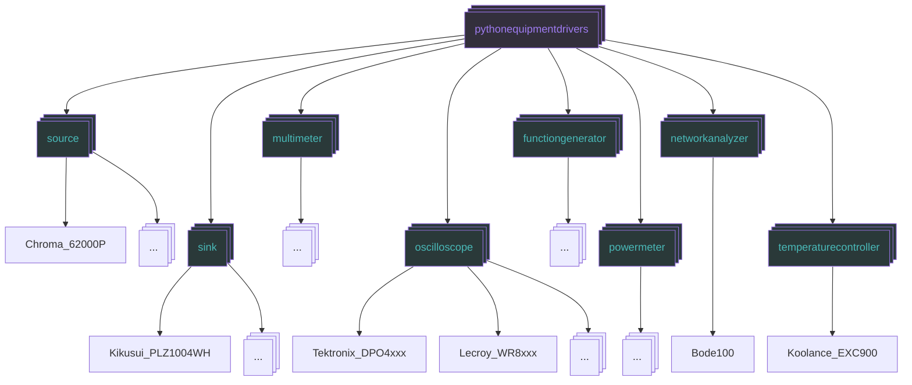

# PythonEquipmentDrivers

## Overview

This module provide a straightforward interface to communicate with various electronics laboratory instruments. Instrument drivers are written to allow an engineer or technician to easily interface with their equipment without having to worry about constructing or parsing the command syntax for their particular instrument.

The driver classes included within are writen to handle the lower-level commands and queries used by the equipment and provide a simple interface in which specified command voltages/currents can be set using floating point numbers, modifying on/off state can be set/queried with boolean values, and parsing through string responses is not needed to interpret measurement results.

[Installation Guide](installation.md)

## Module Structure

Often, model numbers for differnt types of equipment made by the same manufacturer can have very similar names.

For example:
 
> - Chroma 66204: 3-phase Powermeter
> - Chroma 63206A: DC Electronic Load
> - Chroma 62000P: DC Source

To help users navigate the collection of supported devices to find their instrument the module is constructed as a collection of sub-modules which contain different categories of equipment.

With this in place the various sub-modules, and their containing driver classes, can be accessed via the `.` operator.

Currently the module has 8 such categories:

* Voltage Sources (`pythonequipmentdrivers.source`)
* Electronic Loads (`pythonequipmentdrivers.sink`)
* Multimeters (`pythonequipmentdrivers.multimeter`)
* Oscilloscopes (`pythonequipmentdrivers.oscilloscope`)
* Function Generators (`pythonequipmentdrivers.functiongenerator`)
* Power Meters/Analyzers (`pythonequipmentdrivers.powermeter`)
* Network Analyzers (`pythonequipmentdrivers.networkanalyzer`)
* Temperature Controllers (`pythonequipmentdrivers.temperaturecontroller`)



## Examples
To create a connection to an instrument supported by this library it's respective class needs to be instantiated with the address of the instrument you wish to control.
For example, to control a Chroma 62012P voltage source on a GPIB interface at address 14:
```python
import pythonequipmentdrivers as ped
source = ped.source.Chroma_62000P('GPIB0::14::INSTR')
```
With this instance, various features of the instrument can be access through its methods.
```python
source.set_voltage(48)
print(source.measure_voltage())
# 47.98645785
```
PythonEquipmentDrivers comes with a built in utility for identifing (most) connected instruments if the addresses are not known.
```python
import pythonequipmentdrivers as ped
ped.identify_visa_resources()
```
By instantiating multiple instruments simple tests can be scripted to automatically log data for a "device under test" (DUT)
Here is an example test which measures the efficiency of a power converter over multiple operating points and logs the resulting data to file:
```python
import pythonequipmentdrivers as ped
from time import sleep

# connect to equipment
source = ped.source.Chroma_62000P('GPIB0::14::INSTR')
v_in_meter = ped.multimeter.Keysight_34461A('USB0::0x2A8D::0x1301::MY59026778::INSTR')
v_out_meter = ped.multimeter.Keysight_34461A('USB0::0x2A8D::0x1301::MY59026586::INSTR')
sink = ped.sink.Chroma_63206A('GPIB0::3::INSTR')

# initialize
source.set_voltage(0)
source.off()
source.set_current(10)

sink.off()
sink.set_mode('CC')
sink.set_current(0)

v_in_meter.set_mode('VDC')
v_out_meter.set_mode('VDC')

# conditions to test
v_in_conditions = (40, 48, 54, 60)
i_out_conditions = range(0, 120+1, 10)
measure_delay = 0.5
cooldown_delay = 5
data_file_name = 'C:\\top_sneaky\\my_first_test.csv'

# run test
data = [['v_in_set', 'i_out_set', 'v_in', 'i_in', 'v_out', 'i_out', 'efficiency']]
source.on()
sink.on()
for v_in_set in v_in_conditions:
    source.set_voltage(v_in_set)
    for i_out_set in i_out_conditions:
        print(f'Testing V_in = {v_in_set} V, I_out = {i_out_set} A')
        sink.set_current(i_out_set)
        sleep(measure_delay)
        datum = [v_in_set,
                 i_out_set,
                 v_in_meter.measure_voltage(),
                 source.measure_current(),
                 v_out_meter.measure_voltage(),
                 sink.measure_current()]

        sink.set_current(0)

        # calculations
        eff = (datum[4]*datum[5])/(datum[2]*datum[3])
        # add to data
        datum.append(eff)
        data.append(datum)

        sleep(cooldown_delay) # cool down unit

# shutdown test setup
print('Test complete!')
source.set_voltage(0)
source.off()
sink.set_current(0)
sink.off()

# log data
with open(data_file_name, "w") as file:
    for row in data:
        print(*row, sep=',', end='\n')
print(f'data saved to: {data_file_name}')
```

See the examples folder within this repository for additional examples.

## Contributing
Would you like to contribue to the module? Whether its adding support for more instruments, creating utilities for testing, fixing bugs, or adding to the documentation your contributions are welcome.

Please visit the [how to contribute](.\how_to_contribute.md) doc to learn more.

